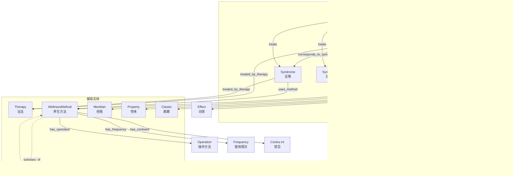

# 中医知识图谱 Schema 可视化

## 📊 实体关系图 (ER Diagram)




## 🔗 核心关系模式

### 1. 疾病诊疗路径
```
Disease --has_symptom--> Symptom
     --corresponds_to_syndrome--> Syndrome
     --treated_by_therapy--> Therapy
     --uses_method--> WellnessMethod
```

**示例**:
```
感冒 --有症状--> 发热、咳嗽
   --对应证候--> 风寒束表证
   --采用治法--> 解表法
   --采用方法--> 饮食养生（喝姜汤）
```

### 2. 方剂组成与治疗
```
Prescription --composed_of--> Herb
           --treats--> Disease/Symptom/Syndrome
           --belongs_to_category--> Category
           --from_classic--> Classic
```

**示例**:
```
香砂六君子汤 --由...组成--> 人参、白术、茯苓、甘草
         --治疗--> 脾胃虚寒、食欲不振
         --属于分类--> 补气剂
         --出自典籍--> 《太平惠民和剂局方》
```

### 3. 药物属性
```
Herb --has_property--> Property
   --belongs_to_meridian--> Meridian
   --has_effect--> Effect
```

**示例**:
```
人参 --具有性味--> 甘、温
   --归经--> 脾经、肺经
   --功效--> 大补元气
```

### 4. 养生方法
```
WellnessMethod --has_operation--> Operation
             --has_frequency--> Frequency
             --has_contraint--> Constraint
             --related_to_season--> Season
```

**示例**:
```
艾灸 --操作方法--> 每穴灸10-15分钟
   --使用频次--> 每周2-3次
   --禁忌--> 高热患者禁用
   --相关节气--> 冬季
```

## 📈 数据流向

```
health-sample.owl (OWL/RDF)
        ↓
  RDFLib 解析
        ↓
  提取三元组
        ↓
  映射到 Neo4j Schema
        ↓
  生成 Cypher 语句
        ↓
  导入 Neo4j
        ↓
  知识图谱构建完成
```

## 🎯 典型查询场景

### 场景 1: 查询疾病的治疗方法
```cypher
MATCH (d:Disease {name: '感冒'})-[:TREATS]-(p:Prescription)
RETURN p.name, p.category
```

### 场景 2: 查询方剂的组成
```cypher
MATCH (p:Prescription {name: '香砂六君子汤'})-[:COMPOSED_OF]->(h:Herb)
RETURN h.name, h.property
```

### 场景 3: 查询药物的归经和功效
```cypher
MATCH (h:Herb {name: '人参'})-[:BELONGS_TO_MERIDIAN]->(m:Meridian),
      (h)-[:HAS_PROPERTY]->(pr:Property)
RETURN m.name, pr.name
```

### 场景 4: 查询适合的养生方法
```cypher
MATCH (d:Disease {name: '失眠'})-[:USES_METHOD]->(w:WellnessMethod)
RETURN w.name, w.operation, w.frequency
```

### 场景 5: 查询某类方剂
```cypher
MATCH (p:Prescription)-[:BELONGS_TO_CATEGORY]->(c {name: '补气剂'})
RETURN p.name, p.treats
```

## 💡 Schema 特点

1. **层次清晰**: 核心实体 + 辅助实体，结构明确
2. **关系丰富**: 18 种关系覆盖多种语义
3. **易于扩展**: 可以方便地添加新实体和关系
4. **实用性强**: 支持常见的中医问答场景
5. **符合规范**: 基于 OWL 本体，保证数据质量

---

*创建日期: 2026-04-03*
