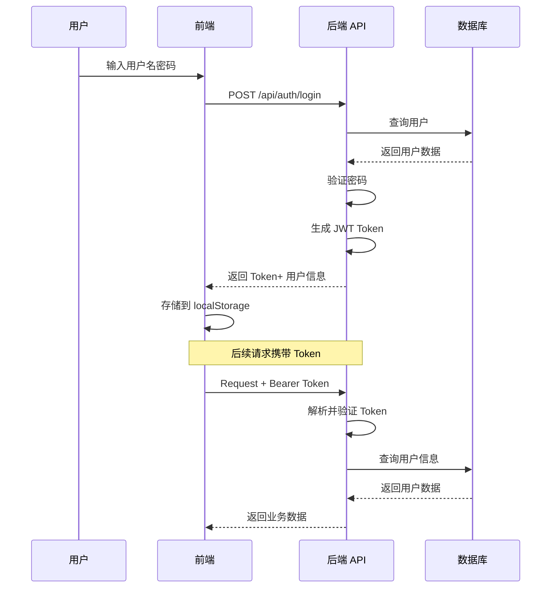

# 用户认证系统技术文档

## 1. 系统架构

### 1.1 技术栈
- **后端**: FastAPI + SQLAlchemy + JWT
- **前端**: Vue3 + Element Plus + Axios
- **数据库**: SQLite (用户数据) + Neo4j (知识图谱)
- **加密**: bcrypt + python-jose

### 1.2 认证流程


---

## 2. 核心代码实现

### 2.1 密码加密 (backend/app/services/auth/security.py)

```python
from passlib.context import CryptContext
import bcrypt

pwd_context = CryptContext(schemes=["bcrypt"], deprecated="auto")

def verify_password(plain_password: str, hashed_password: str) -> bool:
    """验证密码"""
    try:
        return pwd_context.verify(plain_password, hashed_password)
    except:
        return bcrypt.checkpw(plain_password.encode('utf-8'), 
                             hashed_password.encode('utf-8'))

def get_password_hash(password: str) -> str:
    """生成密码哈希"""
    salt = bcrypt.gensalt()
    hashed = bcrypt.hashpw(password.encode('utf-8'), salt)
    return hashed.decode('utf-8')
```

**技术要点**:
- 使用 bcrypt 算法，自动加盐
- 兼容 passlib 和原生 bcrypt
- 防止彩虹表攻击

### 2.2 JWT Token 生成与解析

```python
from jose import jwt
from datetime import datetime, timedelta

SECRET_KEY = "your-secret-key-change-in-production"
ALGORITHM = "HS256"
ACCESS_TOKEN_EXPIRE_MINUTES = 30

def create_access_token(data: dict, expires_delta: Optional[timedelta] = None) -> str:
    """创建访问令牌"""
    to_encode = data.copy()
    if expires_delta:
        expire = datetime.utcnow() + expires_delta
    else:
        expire = datetime.utcnow() + timedelta(minutes=15)
    
    to_encode.update({"exp": expire})
    encoded_jwt = jwt.encode(to_encode, SECRET_KEY, algorithm=ALGORITHM)
    return encoded_jwt

async def get_current_user(token: str = Depends(oauth2_scheme)) -> User:
    """获取当前用户"""
    credentials_exception = HTTPException(
        status_code=status.HTTP_401_UNAUTHORIZED,
        detail="无法验证凭据",
        headers={"WWW-Authenticate": "Bearer"},
    )
    
    try:
        payload = jwt.decode(token, SECRET_KEY, algorithms=[ALGORITHM])
        username: str = payload.get("sub")
        if username is None:
            raise credentials_exception
        # 关键修复：将大写角色转换为小写
        role_value = payload.get("role", "user").lower()
        token_data = TokenData(username=username, role=role_value)
    except JWTError:
        raise credentials_exception
    
    user = db.query(User).filter(User.username == token_data.username).first()
    if user is None:
        raise credentials_exception
    
    return user
```

**Token 结构**:
```json
{
  "sub": "admin",
  "role": "ADMIN",  // 注意：这里是大写
  "exp": 1775055094
}
```

**解析时的转换**:
```python
role_value = payload.get("role", "user").lower()  # 转换为小写
token_data = TokenData(username=username, role=role_value)
```

---

### 2.3 数据库模型 (backend/app/db/user_model.py)

```python
from sqlalchemy import Column, Integer, String, Boolean, DateTime, Enum as SQLEnum
from sqlalchemy.ext.declarative import declarative_base
from datetime import datetime
import enum

Base = declarative_base()

class UserRole(enum.Enum):
    USER = "user"
    ADMIN = "admin"

class User(Base):
    __tablename__ = "users"
    
    id = Column(Integer, primary_key=True, index=True)
    username = Column(String, unique=True, index=True, nullable=False)
    email = Column(String, unique=True, index=True, nullable=False)
    hashed_password = Column(String, nullable=False)
    role = Column(SQLEnum(UserRole), default=UserRole.USER, nullable=False)
    is_active = Column(Boolean, default=True)
    created_at = Column(DateTime, default=datetime.utcnow)
```

**关键点**:
- SQLAlchemy 的 Enum 使用 Python enum.Enum
- Pydantic 的 Enum 继承 str, Enum
- 需要在两者之间进行类型转换

---

### 2.4 Pydantic 模型 (backend/app/models/user.py)

```python
from pydantic import BaseModel, EmailStr
from typing import Optional
from datetime import datetime
from enum import Enum

class UserRole(str, Enum):
    USER = "user"
    ADMIN = "admin"

class UserBase(BaseModel):
    username: str
    email: str
    role: UserRole = UserRole.USER

class UserCreate(UserBase):
    password: str
    role: UserRole = UserRole.USER

class UserLogin(BaseModel):
    username: str
    password: str

class UserResponse(UserBase):
    id: int
    created_at: datetime
    is_active: bool
    
    class Config:
        from_attributes = True

class ProfileUpdate(BaseModel):
    username: str
    email: Optional[str] = None

class PasswordChange(BaseModel):
    old_password: str
    new_password: str
```

---

## 3. API 接口设计

### 3.1 用户注册
```http
POST /api/auth/register
Content-Type: application/json

{
  "username": "testuser",
  "email": "test@example.com",
  "password": "password123",
  "role": "user"
}
```

**响应**:
```json
{
  "username": "testuser",
  "email": "test@example.com",
  "role": "user",
  "id": 1,
  "created_at": "2026-04-01T14:00:00",
  "is_active": true
}
```

### 3.2 用户登录
```http
POST /api/auth/login
Content-Type: application/json

{
  "username": "admin",
  "password": "admin123"
}
```

**响应**:
```json
{
  "access_token": "eyJhbGciOiJIUzI1NiIsInR5cCI6IkpXVCJ9...",
  "token_type": "bearer",
  "user": {
    "username": "admin",
    "email": "admin@tcm-kg.com",
    "role": "admin",
    "id": 1,
    "created_at": "2026-03-28T16:12:54",
    "is_active": true
  }
}
```

### 3.3 获取当前用户信息
```http
GET /api/auth/me
Authorization: Bearer <token>
```

### 3.4 更新个人资料
```http
PUT /api/auth/profile
Authorization: Bearer <token>
Content-Type: application/json

{
  "username": "new_username",
  "email": "unchanged@example.com"
}
```

### 3.5 修改密码
```http
PUT /api/auth/password
Authorization: Bearer <token>
Content-Type: application/json

{
  "old_password": "oldpass123",
  "new_password": "newpass456"
}
```

---

## 4. 前端实现

### 4.1 路由守卫 (frontend/src/router/index.js)

```javascript
router.beforeEach((to, from, next) => {
  const token = localStorage.getItem('token')
  const user = JSON.parse(localStorage.getItem('user') || '{}')
  
  // 如果访问登录页，直接放行
  if (to.path === '/login') {
    if (token) {
      next('/')  // 已登录则跳转到首页
    } else {
      next()
    }
    return
  }
  
  // 检查是否需要认证
  if (to.meta.requiresAuth && !token) {
    next('/login')
    return
  }
  
  // 检查角色权限
  if (to.meta.role && to.meta.role !== user.role) {
    next('/')  // 没有权限访问该页面，重定向到首页
    return
  }
  
  next()
})
```

**路由配置**:
```javascript
const routes = [
  { path: '/login', name: 'Login', component: () => import('@/views/Login.vue') },
  { path: '/', name: 'Home', component: () => import('@/views/Home.vue') },
  { path: '/qa', name: 'QA', component: () => import('@/views/QA.vue') },
  { path: '/kg-visual', name: 'KGVisual', component: () => import('@/views/KGVisual.vue') },
  { path: '/profile', name: 'Profile', component: () => import('@/views/Profile.vue'), meta: { requiresAuth: true } },
  { path: '/crawler-config', name: 'CrawlerConfig', component: () => import('@/views/CrawlerConfig.vue'), meta: { requiresAuth: true, role: 'admin' } },
  { path: '/data-management', name: 'DataManagement', component: () => import('@/views/DataManagement.vue'), meta: { requiresAuth: true, role: 'admin' } },
  { path: '/algorithm-config', name: 'AlgorithmConfig', component: () => import('@/views/AlgorithmConfig.vue'), meta: { requiresAuth: true, role: 'admin' } }
]
```

### 4.2 动态菜单 (frontend/src/App.vue)

```vue
<el-menu :default-active="$route.path" router>
  <el-menu-item index="/">
    <span>🏠 首页</span>
  </el-menu-item>
  <el-menu-item index="/qa">
    <span>💬 智能问答</span>
  </el-menu-item>
  <el-menu-item index="/kg-visual">
    <span>🕸️ 知识可视化</span>
  </el-menu-item>
  
  <!-- 管理员专属菜单 -->
  <template v-if="userRole === 'admin'">
    <el-menu-item index="/crawler-config">
      <span>🕷️ 爬虫配置</span>
    </el-menu-item>
    <el-menu-item index="/data-management">
      <span>💾 数据管理</span>
    </el-menu-item>
    <el-menu-item index="/algorithm-config">
      <span>⚙️ 算法配置</span>
    </el-menu-item>
  </template>
</el-menu>
```

### 4.3 用户状态管理

```javascript
computed: {
  user() {
    const userStr = localStorage.getItem('user')
    return userStr ? JSON.parse(userStr) : null
  },
  userRole() {
    return this.user?.role || 'user'
  }
}
```

---

## 5. 安全性考虑

### 5.1 密码安全
- ✅ 使用 bcrypt 加密，自动加盐
- ✅ 密码长度至少 6 位（可加强）
- ⚠️ 建议：添加密码复杂度要求（大小写、数字、特殊字符）

### 5.2 Token 安全
- ✅ JWT 设置过期时间（30 分钟）
- ✅ 使用 OAuth2PasswordBearer 标准
- ⚠️ 建议：实现 refresh token 机制
- ⚠️ 建议：添加 token 黑名单

### 5.3 CORS 配置
```python
app.add_middleware(
    CORSMiddleware,
    allow_origins=["*"],  # ⚠️ 生产环境应限制具体域名
    allow_credentials=True,
    allow_methods=["*"],
    allow_headers=["*"],
)
```

### 5.4 数据库安全
- ✅ 使用 ORM 防止 SQL 注入
- ✅ 密码字段不返回给前端
- ⚠️ 建议：敏感操作记录日志

---

## 6. 常见问题与解决方案

### 6.1 Enum 类型不匹配
**问题**: SQLAlchemy Enum vs Pydantic Enum
```python
# SQLAlchemy 期望枚举对象
role = Column(SQLEnum(UserRole))

# Pydantic 接收字符串
role: UserRole = UserRole.USER
```

**解决**:
```python
# 在注册接口中进行类型转换
if isinstance(user_data.role, str):
    db_role = DBUserRole[user_data.role.upper()]
else:
    db_role = DBUserRole[user_data.role.value]
```

### 6.2 Token 角色大小写
**问题**: JWT 中 role.name 是大写，Pydantic 期望小写
```python
# Token 内容
{"role": "ADMIN"}

# Pydantic 期望
role: UserRole.USER  # "user"
```

**解决**:
```python
role_value = payload.get("role", "user").lower()
token_data = TokenData(username=username, role=role_value)
```

### 6.3 前端请求格式
**问题**: 表单格式 vs JSON 格式
```javascript
// ❌ 错误：表单格式
const formData = new URLSearchParams()
formData.append('username', username)

// ✅ 正确：JSON 格式
await axios.post('/api/auth/login', {
  username: username,
  password: password
})
```

---

## 7. 测试用例

### 7.1 单元测试
```python
def test_password_hash():
    password = "test123"
    hashed = get_password_hash(password)
    assert verify_password(password, hashed)
    assert not verify_password("wrong", hashed)

def test_create_access_token():
    data = {"sub": "test", "role": "user"}
    token = create_access_token(data)
    assert isinstance(token, str)
    assert len(token) > 0
```

### 7.2 集成测试
```python
def test_register_and_login():
    # 注册
    response = client.post("/api/auth/register", json={
        "username": "testuser",
        "email": "test@example.com",
        "password": "test123"
    })
    assert response.status_code == 200
    
    # 登录
    response = client.post("/api/auth/login", json={
        "username": "testuser",
        "password": "test123"
    })
    assert response.status_code == 200
    assert "access_token" in response.json()
```

---

## 8. 性能优化建议

1. **数据库索引**
   ```python
   username = Column(String, unique=True, index=True)  # ✅ 已有
   email = Column(String, unique=True, index=True)     # ✅ 已有
   ```

2. **Token 缓存**
   - 使用 Redis 缓存活跃 token
   - 避免频繁查询数据库

3. **密码验证优化**
   - bcrypt 计算较慢，考虑添加请求频率限制

---

## 9. 扩展功能规划

### 9.1 短期
- [ ] 邮箱验证
- [ ] 密码找回
- [ ] 头像上传后端支持

### 9.2 中期
- [ ] 双因素认证 (2FA)
- [ ] OAuth2 第三方登录
- [ ] 角色权限细粒度控制

### 9.3 长期
- [ ] SSO 单点登录
- [ ] LDAP/AD 集成
- [ ] 审计日志系统

---

## 📚 参考资料

1. [FastAPI 官方文档 - Security](https://fastapi.tiangolo.com/tutorial/security/)
2. [Python-JOSE 文档](https://python-jose.readthedocs.io/)
3. [Passlib 文档](https://passlib.readthedocs.io/)
4. [Vue Router 导航守卫](https://router.vuejs.org/zh/guide/advanced/navigation-guards.html)

---

**文档版本**: 1.0  
**最后更新**: 2026-04-01  
**维护者**: AI Assistant
