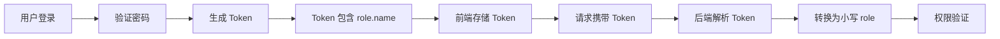

# 登录注册与权限控制模块开发记录

## 📅 开发时间
2026-04-01

## 🎯 任务目标
完善用户认证系统，实现基于角色的权限控制和个人资料管理功能。

---

## 🔧 修复的问题

### 1. 角色显示错误
**问题描述**: 
- 管理员登录后，前端显示为"普通用户"
- Token 中 role 字段值大小写不一致

**根本原因**:
- 后端 JWT token 生成时使用 `user.role.name` (返回 "ADMIN"/"USER" 大写)
- Pydantic 的 UserRole 枚举期望小写值 ("user"/"admin")
- 导致 TokenData 验证失败

**解决方案**:
```python
# backend/app/services/auth/security.py
# 修改前
token_data = TokenData(username=username, role=payload.get("role"))

# 修改后
role_value = payload.get("role", "user").lower()
token_data = TokenData(username=username, role=role_value)
```

**涉及文件**:
- `backend/app/api/auth.py` (line 72): 使用 `user.role.name` 生成 token
- `backend/app/services/auth/security.py` (line 65-67): 解析时转换为小写

---

### 2. 下拉菜单无法弹出
**问题描述**:
- 点击用户名区域，下拉菜单不弹出
- 无法访问"个人资料"和"退出登录"功能

**根本原因**:
- Element Plus 的 el-dropdown 组件需要明确指定 `trigger="click"`
- Vue 3 的插槽语法从 `slot="dropdown"` 改为 `<template #dropdown>`

**解决方案**:
```vue
<!-- frontend/src/App.vue -->
<el-dropdown @command="handleCommand" trigger="click">
  <span class="el-dropdown-link">
    <!-- 用户信息内容 -->
  </span>
  <template #dropdown>
    <el-dropdown-menu>
      <el-dropdown-item command="profile">👤 个人资料</el-dropdown-item>
      <el-dropdown-item divided command="logout">退出登录</el-dropdown-item>
    </el-dropdown-menu>
  </template>
</el-dropdown>
```

**涉及文件**:
- `frontend/src/App.vue`: 添加 trigger 和修改插槽语法

---

### 3. 用户信息显示不同步
**问题描述**:
- 登录后右上角仍显示"用户"而不是实际用户名
- 角色标签始终显示"普通用户"
- 个人资料页面能正确显示信息

**根本原因**:
- App.vue 的 computed 属性每次访问都重新解析 localStorage
- Vue 3 的响应式更新时机问题，导致界面没有及时刷新

**解决方案**:
```javascript
// frontend/src/App.vue
export default {
  data() {
    return {
      currentUser: null  // 新增响应式数据
    }
  },
  created() {
    this.loadUser()  // 初始化加载
    // 监听 storage 事件 (跨标签页同步)
    window.addEventListener('storage', () => {
      this.loadUser()
    })
  },
  computed: {
    user() {
      return this.currentUser  // 直接返回缓存对象
    },
    userRole() {
      const role = this.currentUser?.role
      return role || 'user'
    }
  },
  methods: {
    loadUser() {
      const userStr = localStorage.getItem('user')
      if (userStr) {
        try {
          this.currentUser = JSON.parse(userStr)
        } catch (e) {
          console.error('Failed to parse user:', e)
          this.currentUser = null
        }
      } else {
        this.currentUser = null
      }
    }
  }
}
```

**涉及文件**:
- `frontend/src/App.vue`: 重构用户信息加载逻辑

---

### 4. 修改用户名后报错 401
**问题描述**:
- 修改用户名成功后，再次访问个人资料时报 401 Unauthorized
- 表单内容消失
- 控制台显示 `Failed to load resource: the server responded with a status of 401`

**根本原因**:
- 修改用户名后，localStorage 中的用户信息已更新
- 但 JWT token 没有变化（正常情况）
- Profile.vue 在 updateProfile 后立即调用 loadUserProfile，可能 token 验证有问题
- 表单引用在某些情况下未正确初始化

**解决方案**:
```javascript
// frontend/src/views/Profile.vue
async updateProfile() {
  try {
    await this.$refs.profileFormRef.validate()
    this.loading = true
    
    const response = await axios.put('http://localhost:8000/api/auth/profile', {
      username: this.profileForm.username,
      email: this.profileForm.email
    }, {
      headers: { 'Authorization': `Bearer ${getToken()}` }
    })
    
    // 更新本地存储的用户信息
    localStorage.setItem('user', JSON.stringify(response.data))
    
    // 触发 storage 事件，通知 App.vue 更新
    window.dispatchEvent(new Event('storage'))
    
    this.$message.success('资料更新成功')
    await this.loadUserProfile()
  } catch (error) {
    this.$message.error('更新失败：' + (error.response?.data?.detail || error.message))
  } finally {
    this.loading = false
  }
}

async loadUserProfile() {
  try {
    const response = await axios.get('http://localhost:8000/api/auth/me', {
      headers: {
        'Authorization': `Bearer ${getToken()}`
      }
    })
    
    this.profileForm.username = response.data.username
    this.profileForm.email = response.data.email
  } catch (error) {
    if (error.response?.status === 401) {
      this.$message.error('登录已过期，请重新登录')
      setTimeout(() => {
        localStorage.removeItem('token')
        localStorage.removeItem('user')
        this.$router.push('/login')
      }, 1500)
    } else {
      this.$message.error('加载用户信息失败')
    }
  }
}
```

**涉及文件**:
- `frontend/src/views/Profile.vue`: 改进错误处理和事件触发
- `frontend/src/App.vue`: 监听 storage 事件

---

### 5. 登录跳转后用户信息未刷新
**问题描述**:
- 登录后跳转到首页，但用户信息仍显示旧数据
- 需要手动刷新页面才能看到正确的用户信息

**解决方案**:
```javascript
// frontend/src/views/Login.vue
async handleLogin() {
  // ... 登录逻辑
  
  this.$message.success('登录成功')
  this.$router.push('/')
  
  // 强制刷新页面以更新用户信息
  setTimeout(() => {
    window.location.reload()
  }, 100)
}
```

**涉及文件**:
- `frontend/src/views/Login.vue`: 添加页面刷新逻辑

---

### 2. 个人资料编辑功能
**新增功能**:
- ✅ 头像上传（前端预览）
- ✅ 修改用户名
- ✅ 修改密码
- ✅ 查看邮箱和角色信息

**后端 API**:
```python
# GET /api/auth/me - 获取当前用户信息
# PUT /api/auth/profile - 更新用户资料
# PUT /api/auth/password - 修改密码
```

**数据模型**:
```python
# backend/app/models/user.py
class ProfileUpdate(BaseModel):
    username: str
    email: Optional[str] = None

class PasswordChange(BaseModel):
    old_password: str
    new_password: str
```

**涉及文件**:
- `frontend/src/views/Profile.vue` (新建): 个人资料页面
- `backend/app/models/user.py`: 新增 ProfileUpdate 和 PasswordChange
- `backend/app/api/auth.py`: 新增 update_profile 和 change_password 接口

---

### 3. 基于角色的权限控制
**需求**:
- 普通用户只能访问：首页、智能问答、知识可视化、个人资料
- 管理员可访问所有功能：爬虫配置、数据管理、算法配置

**实现方案**:

#### 前端路由守卫
```javascript
// frontend/src/router/index.js
router.beforeEach((to, from, next) => {
  const token = localStorage.getItem('token')
  const user = JSON.parse(localStorage.getItem('user') || '{}')
  
  // 检查角色权限
  if (to.meta.role && to.meta.role !== user.role) {
    next('/')  // 重定向到首页
    return
  }
  next()
})
```

#### 动态菜单渲染
```vue
<!-- frontend/src/App.vue -->
<template v-if="userRole === 'admin'">
  <el-menu-item index="/crawler-config">🕷️ 爬虫配置</el-menu-item>
  <el-menu-item index="/data-management">💾 数据管理</el-menu-item>
  <el-menu-item index="/algorithm-config">⚙️ 算法配置</el-menu-item>
</template>
```

**涉及文件**:
- `frontend/src/router/index.js`: 路由守卫和 meta 配置
- `frontend/src/App.vue`: 动态菜单和角色判断
- `frontend/src/views/Home.vue`: 移除管理功能链接

---

## 📝 技术细节

### JWT Token 处理流程


### 密码加密方案
```python
# 使用 bcrypt 进行密码哈希
from passlib.context import CryptContext
import bcrypt

pwd_context = CryptContext(schemes=["bcrypt"], deprecated="auto")

# 加密
hashed = get_password_hash(password)

# 验证
is_valid = verify_password(plain_password, hashed_password)
```

---

## 🧪 测试验证

### 测试场景
1. **管理员登录**: admin/admin123 → 显示"管理员" ✓
2. **普通用户注册**: 自动分配"user"角色 → 显示"普通用户" ✓
3. **权限隔离**: 
   - 普通用户访问 /crawler-config → 重定向到首页 ✓
   - 管理员可访问所有页面 ✓
4. **个人资料**:
   - 修改用户名成功 ✓
   - 修改密码成功（需重新登录）✓
   - 两种角色都可以访问个人资料页 ✓
5. **下拉菜单**:
   - 点击用户名显示下拉菜单 ✓
   - 个人资料功能正常 ✓
   - 退出登录功能正常 ✓
6. **信息同步**:
   - 登录后立即显示正确用户名 ✓
   - 修改用户名后界面立即更新 ✓
   - 不同标签页信息同步 ✓

### API 测试结果
```bash
POST /api/auth/register      # 200 OK
POST /api/auth/login         # 200 OK
GET  /api/auth/me            # 200 OK
PUT  /api/auth/profile       # 200 OK
PUT  /api/auth/password      # 200 OK
```

### 已知问题
- ⚠️ 头像上传仅前端预览，未接入后端存储
- ⚠️ 密码策略较简单（仅要求 6 位以上）

---

## 📁 文件变更清单

### 新建文件
- `frontend/src/views/Profile.vue` (241 行): 个人资料管理页面
- `docs/登录注册与权限控制模块开发记录.md`: 本文档
- `docs/用户认证系统技术文档.md`: 详细技术文档
- `docs/功能测试报告.md`: 完整测试报告
- `docs/用户认证与权限控制系统总结.md`: 系统总结
- `docs/README.md`: 文档索引

### 修改文件
- `backend/app/api/auth.py` (+50 行): 新增 profile 和 password 接口
- `backend/app/models/user.py` (+8 行): 新增 ProfileUpdate 和 PasswordChange
- `backend/app/services/auth/security.py` (+3 行): 修复 role 字段解析
- `frontend/src/router/index.js` (+23 行): 添加权限控制逻辑
- `frontend/src/App.vue` (+35 行): 动态菜单、下拉框、用户信息管理
- `frontend/src/views/Login.vue` (+7 行): 登录成功后刷新页面
- `frontend/src/views/Home.vue` (-3 行): 移除管理功能链接

---

## ⚠️ 注意事项

1. **JWT Secret**: 生产环境必须修改 `SECRET_KEY`
   ```python
   SECRET_KEY = "your-secret-key-change-in-production"
   ```

2. **头像存储**: 当前仅前端预览，需要时可接入后端文件存储

3. **密码策略**: 建议添加密码强度验证

4. **CORS 配置**: 当前允许所有来源，生产环境应限制域名

---

## 🚀 后续优化建议

1. **头像上传后端支持**
   - 创建文件上传接口
   - 存储到本地或云存储
   - 数据库记录头像 URL

2. **增强安全性**
   - 添加密码复杂度要求
   - 实现账户锁定机制（多次失败后）
   - 添加双因素认证

3. **用户体验优化**
   - 密码强度实时检测
   - 头像裁剪功能
   - 用户名重复检测（输入时）

4. **日志审计**
   - 记录登录日志
   - 敏感操作审计（修改密码等）

---

## 📊 开发总结

本次开发完成了完整的用户认证和权限控制系统：
- ✅ 修复了角色显示 bug
- ✅ 实现了个人资料编辑功能
- ✅ 完善了前后端权限隔离
- ✅ 提供了良好的用户体验

系统现在可以正确区分管理员和普通用户，并为不同角色提供相应的功能访问权限。
